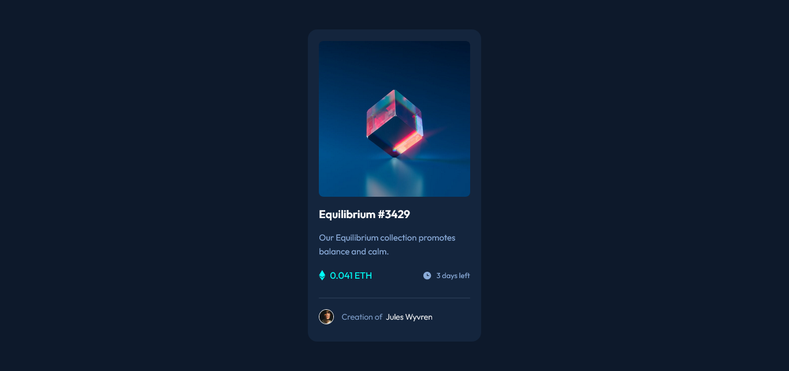
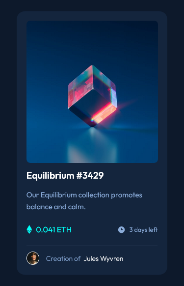

# Frontend Mentor - NFT preview card component solution

This is a solution to the [NFT preview card component challenge on Frontend Mentor](https://www.frontendmentor.io/challenges/nft-preview-card-component-SbdUL_w0U). Frontend Mentor challenges help you improve your coding skills by building realistic projects.

## Table of contents

- [Overview](#overview)
  - [The challenge](#the-challenge)
  - [Screenshot](#screenshot)
  - [Links](#links)
- [My process](#my-process)
  - [Built with](#built-with)
  - [What I learned](#what-i-learned)
  - [Continued development](#continued-development)
  - [Useful resources](#useful-resources)
- [Author](#author)

## Overview

### The challenge

Users should be able to:

- View the optimal layout depending on their device's screen size
- See hover states for interactive elements

### Screenshot

Below is the screenshots of the challenge, the desktop view is 1440px and the mobile view was queried at 375px




### Links

- Solution URL: (https://github.com/Odo-Peter/frontend-mentor-nft-card)
- Live Site URL: [Add live site URL here](https://your-live-site-url.com)

## My process

### Built with

- Semantic HTML5 markup
- CSS custom properties
- Flexbox
- Javascript

### What I learned

This challenge has taught me the importance of a proper markup and the power of CSS, alongside media queries, also, in the cause of the challenge, learning to work with an API as usual again, feels awesome (by API, I meant importing the google fonts from google api and using it in the challenge).

The challenge has also improved my knowledge, in terms of using markdown files and in committing a file to github, basically working with the command line has improved some more, all thanks to this and other frontend mentor's challenge.

Futhermore, I learnt two knew event listeners, which were mouseover and mouseout, this listeners where used in controlling the hover states of the card.

```js
const overlaySvg = document.querySelector('#svg');
const imageView = document.querySelector('#img-view');

overlaySvg.addEventListener('mouseover', (e) => {
  overlaySvg.classList.add('active');
  imageView.style.display = 'block';
});

overlaySvg.addEventListener('mouseout', (e) => {
  overlaySvg.classList.remove('active');
  imageView.style.display = 'none';
})
};
```

### Continued development

In future projects or challenges, I'ld love to add more javascript functions that will either flip the NFT card 180deg or even add a click button that pops a new card on clicking it.

### Useful resources

- [Free code camp](https://www.freecodecamp.org) - This site personally has improved my coding skills from 0 to a reasonable figure, lol, I'll recommend any person new to programming and coding to check free code camp for FREE. Ensure to be kind enough to give a little donation to help them to continue giving out value.
- [Tech Twitter](https://www.twitter.com) - Tech twitter has helped with several links to quality resources, articles, podcasts, videos, etc, that has helped to improve my coding skills and thus helping me complete this challenge.
- [W3schools](https://www.w3schools.com) - Awesome and coincise documentations.

## Author

- Frontend Mentor - [@Odo-Peter](https://www.https://frontendmentor.io/profile/Odo-Peter)
- Twitter - [@Odo_Peter_Ebere](https://www.twitter.com/iCode_X)
- Frontend Mentor - [@Odo-Peter](https://www.frontendmentor.io/profile/Odo-Peter)
